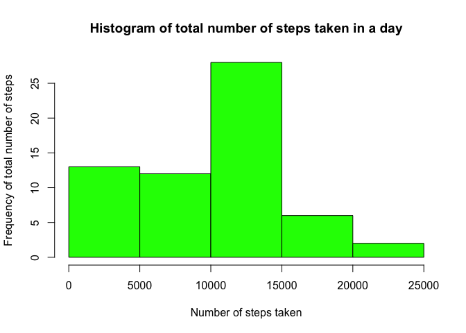
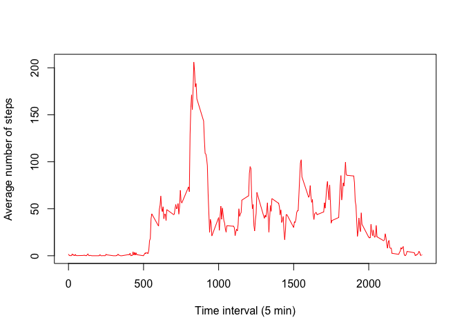
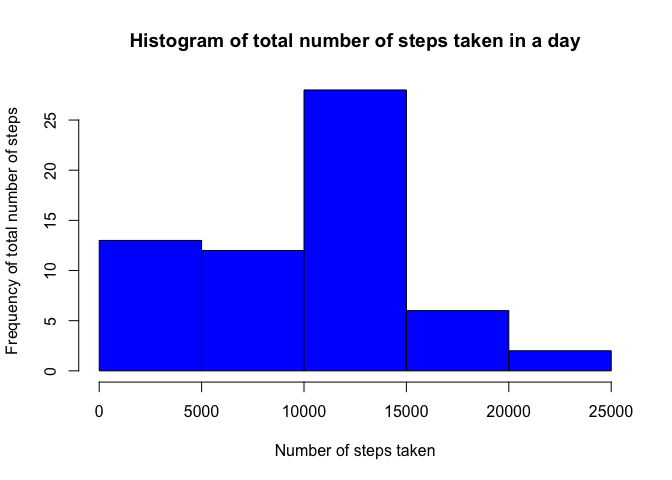
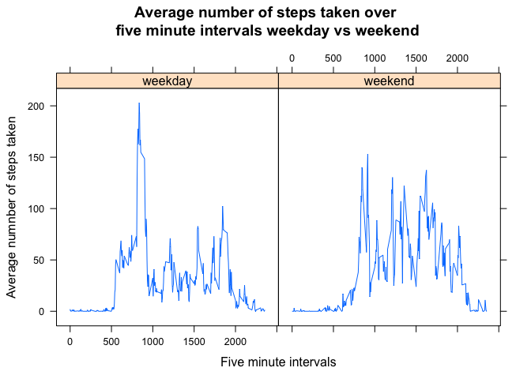

# Activity Data Monitoring

Lets first download the activity monitoring data and read it into R.


```r
URL<- 'https://d396qusza40orc.cloudfront.net/repdata%2Fdata%2Factivity.zip'
download.file(URL, destfile = "/Users/kbarton/RR/activity.zip", method = "curl")
unzip("/Users/kbarton/RR/activity.zip", exdir = "./RR")

data1 <- read.csv("/Users/kbarton/RR/activity.csv")
```

We will then calculate and plot the number of steps taken each day.


```r
data1 <- read.csv("/Users/kbarton/RR/activity.csv")
data1$date<-as.Date(data1$date)
days<-seq(from=as.Date('2012-10-01'), to=as.Date('2012-11-30'), by='days')
d<-data.frame()
for (i in seq_along(days)){
        day_1<-subset(data1, date==(days[i]))
        sum<-sum(day_1$steps, na.rm=TRUE)
        s<-data.frame(sum)
        d<-rbind(d,s)
}

hist(d$sum, main='Histogram of total number of steps taken in a day', xlab='Number of steps taken', ylab='Frequency of total number of steps', col='green')
```

<!-- -->

Determine the mean and the median number of steps taken each day.

```r
mean<-mean(d$sum, na.rm=T)
median<-median(d$sum, na.rm=T)
mean
```

```
## [1] 9354.23
```

```r
median
```

```
## [1] 10395
```

Create a time series plot of the average number of steps taken

```r
seq1<-unique(data1$interval)
stepInt<-data.frame()
for (i in 1:length(seq1)){
        int<-seq1[i]
        int1<-subset(data1, interval == int)
        meanInt<-mean(int1$steps, na.rm=TRUE)
        t<-data.frame(meanInt, int)
        stepInt<-rbind(stepInt,t)
}

#plot of time interval of average steps taken
plot(stepInt$int, stepInt$meanInt, type='l', ylab='Average number of steps', xlab='Time interval (5 min)', col='red')
```

<!-- -->

Identify missing data and replace with 0 (which is the average number of steps for each day). Then, plot the data again with the missing data imputed.

```r
#count the number of NAs in data
totalNA<-sum(is.na(data1$steps))

#create dataframe of means for each day
means<-data.frame()
for (i in seq_along(days)){
        date1<-days[i]
        day_1<-subset(data1, date == date1)
        meansteps<-mean(day_1$steps, na.rm=TRUE)
        s<-data.frame(meansteps, date1)
        means<-rbind(means,s)
}
#replace all Na values with 0
means$meansteps[is.na(means$meansteps)] <- 0

#replicate original data set
newdata<-data1

#replace NAs in original data set with mean of the steps for that day, which is always zero...
newdata$steps[is.na(newdata$steps)] <- means$meansteps[match(newdata$date[is.na(newdata$steps)], means$date)]

#sum all the steps for each day with NAs filled in and generate a histogram
d1<-data.frame()
for (i in seq_along(days)){
        day_1<-subset(newdata, date==(days[i]))
        sum<-sum(day_1$steps)
        s<-data.frame(sum)
        d1<-rbind(d1,s)
}

mean1<-mean(d1$sum)
median1<-median(d1$sum)

hist(d1$sum, main='Histogram of total number of steps taken in a day', xlab='Number of steps taken', ylab='Frequency of total number of steps', col='blue')
```

<!-- -->


Create a panel plot comparing 5-minute intervals between weekdays and weekends.

```r
#add factor variable for weekend and weekdays to newdata
weekend <- c('Saturday', 'Sunday')
newdata$weekday<-factor((weekdays(newdata$date) %in% weekend), levels=c(TRUE, FALSE), labels=c('weekend', 'weekday'))
#subset new data into weekday and weekend
weekend1<-subset(newdata, weekday=='weekend')
weekday1<-subset(newdata, weekday=='weekday')

WEInt<-data.frame()
for (i in 1:length(seq1)){
        int<-seq1[i]
        int1<-subset(weekend1, interval == int)
        meanInt<-mean(int1$steps, na.rm=TRUE)
        t<-data.frame(meanInt, int)
        WEInt<-rbind(WEInt,t)
}

WDInt<-data.frame()
for (i in 1:length(seq1)){
        int<-seq1[i]
        int1<-subset(weekday1, interval == int)
        meanInt<-mean(int1$steps, na.rm=TRUE)
        t<-data.frame(meanInt, int)
        WDInt<-rbind(WDInt,t)
}

WEInt$weekday<-'weekend'
WDInt$weekday<-'weekday'

WEmat<-rbind(WEInt, WDInt)

library(lattice)
xyplot(meanInt~int|weekday, data=WEmat, type='l', xlab='Five minute intervals',
       ylab='Average numnber of steps taken',
       main='Average number of steps taken over\n five minute intervals weekday vs weekend')
```

<!-- -->
